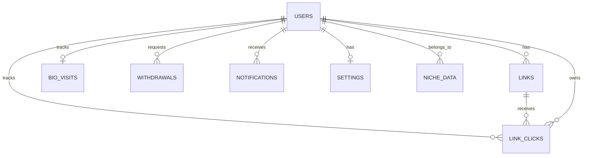

# Database Design - YNLinks

---

## Design Overview

- **Single Convex database** (no separate services)
- **Document-based** (no traditional SQL joins)
- **Real-time sync** built-in
- **No UUIDs needed** — Convex auto-generates `_id`

---

## Schema Overview



---

## Core Tables

### 1. `users`

| Column | Type | Constraints |
|--------|------|-------------|
| _id | string | PK (auto-generated by Convex) |
| clerkId | string | NOT NULL, UNIQUE |
| username | string | NOT NULL, UNIQUE |
| email | string | NOT NULL, UNIQUE |
| displayName | string | NULL |
| bio | string | NULL |
| avatarUrl | string | NULL |
| phone | string | NULL |
| niche | string | NULL |
| theme | string | NULL, DEFAULT "default" |
| buttonStyle | string | NULL, DEFAULT "rounded" |
| fontStyle | string | NULL, DEFAULT "Inter" |
| avatarShape | string | NULL, DEFAULT "circle" |
| isAdmin | boolean | DEFAULT false |
| earnings | number | DEFAULT 0 |
| socialPlatform | string | NULL |
| socialId | string | NULL |
| customDomain | string | NULL, UNIQUE |
| role | string | NULL, DEFAULT "creator" |
| balance | number | NULL, DEFAULT 0 |
| status | string | NULL, DEFAULT "active" |
| createdAt | string | NULL |
| pageVisible | boolean | NULL, DEFAULT true |
| showBranding | boolean | NULL, DEFAULT true |
| allowIndexing | boolean | NULL, DEFAULT true |
| onboardingComplete | boolean | NULL, DEFAULT false |
| facebookUrl | string | NULL |
| instagramUrl | string | NULL |
| telegramUrl | string | NULL |
| linkedinUrl | string | NULL |
| twitterUrl | string | NULL |
| youtubeUrl | string | NULL |
| location | string | NULL |

**Indexes:**
- `by_clerk_id` (clerkId)
- `by_username` (username)
- `by_email` (email)

### 2. `links`

| Column | Type | Constraints |
|--------|------|-------------|
| _id | string | PK (auto-generated by Convex) |
| userId | string | NOT NULL |
| title | string | NOT NULL |
| url | string | NOT NULL |
| description | string | NULL |
| thumbnailUrl | string | NULL |
| enabled | boolean | DEFAULT true |
| archived | boolean | NULL, DEFAULT false |
| pinned | boolean | NULL, DEFAULT false |
| orderIndex | number | DEFAULT 0 |
| clicks | number | DEFAULT 0 |
| clickCount | number | NULL |
| type | string | NULL |
| imageUrl | string | NULL |

**Indexes:**
- `by_user_id` (userId)
- `by_user_enabled` (userId, enabled)
- `by_user_archived` (userId, archived)
- `by_order` (userId, orderIndex)

### 3. `linkClicks`

| Column | Type | Constraints |
|--------|------|-------------|
| _id | string | PK (auto-generated by Convex) |
| linkId | string | NOT NULL, FK → links |
| userId | string | NOT NULL |
| ipAddress | string | NULL |
| earnings | number | DEFAULT 0 |
| clickedAt | string | NULL |

**Indexes:**
- `by_link_id` (linkId)
- `by_user_id` (userId)
- `by_clicked_at` (clickedAt)

### 4. `bioVisits` (Profile Page Views)

| Column | Type | Constraints |
|--------|------|-------------|
| _id | string | PK (auto-generated by Convex) |
| userId | string | NOT NULL |
| ipAddress | string | NULL |
| earnings | number | DEFAULT 0 |
| visitedAt | string | NULL |

**Indexes:**
- `by_user_id` (userId)
- `by_visited_at` (visitedAt)

### 5. `withdrawals` (Payout Requests)

| Column | Type | Constraints |
|--------|------|-------------|
| _id | string | PK (auto-generated by Convex) |
| userId | string | NOT NULL |
| amount | number | NOT NULL |
| status | string | NOT NULL |
| requestedAt | string | NULL |
| processedAt | string | NULL |
| method | string | NULL |
| details | any | NULL |

**Indexes:**
- `by_user_id` (userId)
- `by_status` (status)

### 6. `notifications` (User Notifications)

| Column | Type | Constraints |
|--------|------|-------------|
| _id | string | PK (auto-generated by Convex) |
| userId | string | NOT NULL |
| message | string | NOT NULL |
| read | boolean | DEFAULT false |
| createdAt | string | NULL |

**Indexes:**
- `by_user_id` (userId)
- `by_read` (read)

### 7. `advertiserInquiries` (Business Contacts)

| Column | Type | Constraints |
|--------|------|-------------|
| _id | string | PK (auto-generated by Convex) |
| name | string | NOT NULL |
| email | string | NOT NULL |
| message | string | NOT NULL |
| status | string | NULL |
| createdAt | string | NULL |

**Indexes:**
- `by_created_at` (createdAt)

### 8. `niches` (Content Categories)

| Column | Type | Constraints |
|--------|------|-------------|
| _id | string | PK (auto-generated by Convex) |
| name | string | NOT NULL |
| slug | string | NOT NULL, UNIQUE |
| customDomain | string | NULL |
| adCode | string | NULL |

**Indexes:**
- `by_slug` (slug)

### 9. `settings` (Global Settings)

| Column | Type | Constraints |
|--------|------|-------------|
| _id | string | PK (auto-generated by Convex) |
| key | string | NOT NULL |
| value | string | NOT NULL |

**Indexes:**
- `by_key` (key)

### 10. `analytics` (Event Tracking)

| Column | Type | Constraints |
|--------|------|-------------|
| _id | string | PK (auto-generated by Convex) |
| userId | string | NOT NULL |
| ipAddress | string | NULL |
| userAgent | string | NULL |
| timestamp | string | NULL |

**Indexes:**
- `by_user_id` (userId)
- `by_timestamp` (timestamp)

---

## Indexes (Defined in Schema)

### Table → Index Mapping

| Table | Index Name | Fields | Used By Queries |
|-------|-----------|--------|----------------|
| **users** | by_clerk_id | clerkId | getUserByClerkId, createUser, deleteAccount |
| | by_username | username | getUserByUsername, checkUsernameAvailability, updateUserProfile |
| | by_email | email | checkEmailAvailability |
| **links** | by_user_id | userId | getLinksByUser, createLink, clearAllLinks, getLinkCountByUser |
| | by_user_enabled | userId, enabled | getEnabledLinksByUser |
| | by_user_archived | userId, archived | - (unused currently) |
| | by_order | userId, orderIndex | getLinksByUser (sorting) |
| **linkClicks** | by_link_id | linkId | - |
| | by_user_id | userId | deleteAccount, exportUserData |
| | by_clicked_at | clickedAt | - |
| **bioVisits** | by_user_id | userId | deleteAccount |
| | by_visited_at | visitedAt | - |
| **withdrawals** | by_user_id | userId | exportUserData |
| | by_status | status | - |

---

## Queries (All Convex Functions)

### users.ts Queries
```ts
getUserByUsername({ username })    // uses by_username index
getUserByClerkId({ clerkId })     // uses by_clerk_id index
getUserById({ userId })         // direct ID lookup
getAllUsers()                   // no index (full scan)
checkUsernameAvailability()    // uses by_username index
checkEmailAvailability()     // uses by_email index
getUserLinks({ userId })         // uses by_user_id index
exportUserData({ userId })      // multiple by_user_id lookups
```

### users.ts Mutations
```ts
createUser({ clerkId, username, ... })    // uses by_clerk_id + by_username indexes
updateUserProfile({ userId, ... })       // direct ID patch
updateUserTheme({ userId, theme })
updateUserNiche({ userId, niche })
updateUserBalance({ userId, amount })
updatePageSettings({ userId, ... })
clearAllLinks({ userId })            // uses by_user_id index
deleteAccount({ userId })             // multiple by_user_id indexes
```

### links.ts Queries
```ts
getLinksByUser({ userId })          // uses by_user_id index
getEnabledLinksByUser({ userId })   // uses by_user_enabled index
getLinkById({ linkId })           // direct ID lookup
getLinkCountByUser({ userId })     // uses by_user_id index
```

### links.ts Mutations
```ts
createLink({ userId, ... })       // uses by_user_id index (checks limit)
updateLink({ linkId, ... })      // direct ID patch
deleteLink({ linkId })           // direct ID delete
reorderLinks({ userId, linkIds }) // batch patch
toggleLinkEnabled({ linkId })
toggleLinkArchived({ linkId })
toggleLinkPinned({ linkId })
incrementLinkClicks({ linkId, userId }) // updates clicks + inserts linkClicks
```

---

## Key Queries & Patterns

### User Lookup
```ts
// Get user by Clerk ID
getUserByClerkId({ clerkId: string })
  -> WHERE clerkId = ?

// Get user by username
getUserByUsername({ username: string })
  -> WHERE username = ?
```

### Link Management
```ts
// Get user's active links
getEnabledLinksByUser({ userId: string })
  -> WHERE userId = ? AND enabled = true

// Get all links for admin
getAllLinks({ userId: string })
  -> WHERE userId = ?
```

### Analytics Tracking
```ts
// Record link click
createLinkClick({ linkId, userId, ipAddress })
  -> INSERT INTO linkClicks

// Record bio visit
createBioVisit({ userId, ipAddress })
  -> INSERT INTO bioVisits
```

### Profile Update
```ts
// Update profile settings
updateUserProfile({
  userId,
  username,
  niche,
  theme,
  avatarShape,
  // ... other fields
})
  -> UPDATE users SET ...
```

---

## Data Flow

1. **User Creation**
   Clerk webhook → Insert user with `pending_username`
   → Onboarding updates to custom username
   → Profile visible at `/u/[username]`

2. **Click Tracking**
   User clicks link → Record in `linkClicks`
   Update link's `clicks` counter
   Credit earnings if applicable

3. **Page Views**
   Visitor visits profile → Record in `bioVisits`
   Track earnings (impressions)

---

## Migration Strategy

Since Convex is schemaless:
- Add new fields to tables (breaking changes handled by Convex)
- No traditional migrations needed
- Version your API endpoints instead
- Use soft deletes where needed (`archived: boolean`)

---

## Security Considerations

- All mutations include `userId` for authorization
- No cross-collection FKs (referenced by `userId`)
- Sensitive data stored Clerk-side (passwords)
- Email addresses exposed in Convex (consider encryption if needed)

---

## Performance Notes

- Indexes exist on all foreign keys
- No JOINs needed (data already denormalized)
- Real-time queries work via Convex subscriptions
- Aggregation done in frontend or via API endpoints